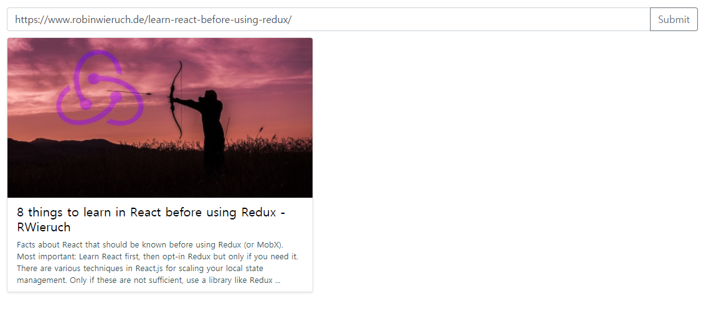
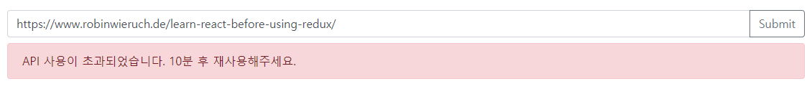

# React Social Card
입력한 URL로 소셜 카드를 만드는 앱입니다. 
상단의 입력폼에 URL을 입력하고 SUBMIT을 눌러주세요.

## 셋업
 ```
 npm install
 npm start

 # 테스트
 npm test
 ```
 
## 소셜 카드란?


페이스북, 슬랙, 네이버 블로그 등에 URL을 공유하면 자동적으로 위와 같은 포스트 미리보기 기능을 제공하는데, 이것을 소셜카드라고 합니다.


## 스크린샷



 **※ 주의**
[OPEN GRAPH API](https://www.opengraph.io/)를 사용하였습니다. 무료 티어 계정이기 때문에 API 사용이 10분에 20회, 월 5000회로 제한되어 있습니다. 
